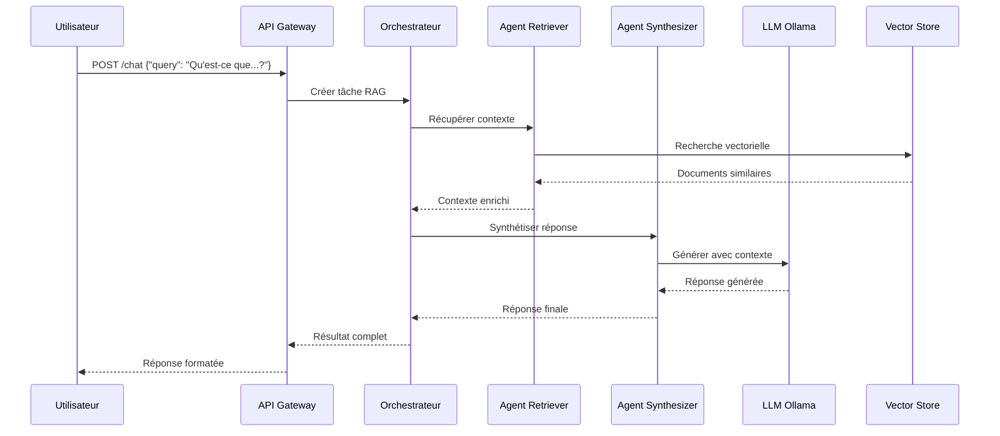

# 🤖 Plateforme MAR (Multi-Agent RAG) 

## 🎯 Vue d'ensemble

Plateforme **industrielle, observable, sécurisée et 100% locale** combinant agents IA spécialisés, LLMs locaux, et systèmes de récupération vectorielle pour des applications RAG avancées.

**✅ Prête pour la production | 🔒 100% locale | 🚀 Auto-déployable | 📊 Observable**

---

## 🏗️ Architecture

```
┌─────────────────┐    ┌──────────────────┐    ┌─────────────────┐
│                 │    │                  │    │                 │
│   UI Frontend   │◄──►│   API Gateway    │◄──►│  Orchestrateur  │
│ (Streamlit/React│    │    (FastAPI)     │    │    (CrewAI)     │
│                 │    │                  │    │                 │
└─────────────────┘    └──────────────────┘    └─────────────────┘
                                │                        │
                                ▼                        ▼
                       ┌──────────────────┐    ┌─────────────────┐
                       │                  │    │                 │
                       │   LLM Service    │    │  Agents Pool    │
                       │    (Ollama)      │    │ Retriever/      │
                       │                  │    │ Summarizer/...  │
                       └──────────────────┘    └─────────────────┘
                                │                        │
                                ▼                        ▼
                       ┌──────────────────┐    ┌─────────────────┐
                       │                  │    │                 │
                       │  Vector Store    │    │  Observabilité  │
                       │ (FAISS/Chroma)   │    │ Prometheus/     │
                       │                  │    │ Grafana/ELK     │
                       └──────────────────┘    └─────────────────┘
```

---

## 📁 Arborescence du Projet

```
📦 plateforme-mar/
├── 📁 agents/                      # Agents IA spécialisés
│   ├── 📁 retriever/              # Agent de récupération vectorielle
│   ├── 📁 summarizer/             # Agent de résumé
│   ├── 📁 synthesizer/            # Agent de synthèse contextualisée
│   ├── 📁 critic/                 # Agent de validation/QA
│   └── 📁 ranker/                 # Agent de classement (optionnel)
├── 📁 orchestrator/               # Orchestrateur CrewAI
│   ├── 📁 crew/                   # Définitions d'équipes
│   ├── 📁 tasks/                  # Tâches et workflows
│   └── 📁 tools/                  # Outils partagés
├── 📁 api/                        # API Gateway FastAPI
│   ├── 📁 routers/                # Endpoints par domaine
│   ├── 📁 middleware/             # Middleware custom
│   └── 📁 auth/                   # Authentification & sécurité
├── 📁 llm/                        # Service LLM local
│   ├── 📁 ollama/                 # Wrapper Ollama
│   ├── 📁 models/                 # Gestion des modèles
│   └── 📁 pooling/                # Pool de connexions
├── 📁 vector_store/               # Stockage vectoriel implémenté
│   ├── � __init__.py             # Module vector store
│   ├── 📄 models.py               # Modèles de données
│   ├── 📄 base.py                 # Interface abstraite
│   ├── 📄 faiss_store.py          # Implémentation FAISS
│   ├── � chroma_store.py         # Implémentation ChromaDB
│   └── � ingestion.py            # Système d'ingestion
├── 📁 ui/                         # Interfaces utilisateur
│   └── 📁 streamlit/              # UI Streamlit moderne
│       ├── � app.py              # Application principale
│       ├── � Dockerfile          # Image Docker UI
│       └── � requirements.txt    # Dépendances UI
├── 📁 docker/                     # Conteneurisation
│   ├── 📁 services/               # Dockerfiles par service
│   └── 📁 base/                   # Images de base
├── 📁 k8s/                        # Orchestration Kubernetes
│   ├── 📁 helm/                   # Charts Helm
│   │   ├── 📁 charts/             # Charts principaux
│   │   ├── 📁 templates/          # Templates Kubernetes
│   │   └── 📁 values/             # Valeurs par environnement
│   └── 📁 manifests/              # Manifestes YAML bruts
├── 📁 monitoring/                 # Observabilité complète
│   ├── 📁 prometheus/             # Métriques
│   │   ├── 📁 rules/              # Règles d'alerting
│   │   └── 📁 config/             # Configuration
│   ├── 📁 grafana/                # Visualisation
│   │   ├── 📁 dashboards/         # Tableaux de bord
│   │   └── 📁 datasources/        # Sources de données
│   └── 📁 elk/                    # Logs centralisés
│       ├── 📁 elasticsearch/      # Index et mapping
│       ├── 📁 logstash/           # Pipeline de traitement
│       └── 📁 kibana/             # Interface de recherche
├── 📁 ci-cd/                      # Déploiement continu
│   ├── 📁 github-actions/         # Pipelines GitHub
│   └── 📁 argocd/                 # GitOps (optionnel)
├── 📁 tests/                      # Tests automatisés
│   ├── 📁 unit/                   # Tests unitaires
│   ├── 📁 integration/            # Tests d'intégration
│   └── 📁 e2e/                    # Tests end-to-end
├── 📁 scripts/                    # Scripts utilitaires
│   ├── 📁 deployment/             # Scripts de déploiement
│   ├── 📁 maintenance/            # Scripts de maintenance
│   └── 📁 ingestion/              # Scripts d'ingestion
├── 📁 docs/                       # Documentation
│   ├── 📁 api/                    # Documentation API
│   ├── 📁 architecture/           # Architecture technique
│   └── 📁 deployment/             # Guide de déploiement
├── 📁 data/                       # Données
│   ├── 📁 documents/              # Documents sources
│   └── 📁 vectors/                # Index vectoriels
├── 📁 config/                     # Configuration
└── 📁 logs/                       # Logs locaux
```

---

## 🚀 Démarrage Rapide

### Prérequis

- **Docker** 20.10+
- **Docker Compose** 2.0+
- **Python** 3.10+
- **Node.js** 18+ (pour l'UI React)
- **Kubernetes** (Minikube/k3s pour local)

### Installation Express

```bash
# 1. Cloner le projet
git clone <repository-url>
cd plateforme-mar

# 2. Initialiser l'environnement
./scripts/deployment/init.sh

# 3. Démarrer tous les services
docker-compose up -d

# 4. Vérifier le déploiement
./scripts/deployment/health-check.sh

# 5. Accéder à l'interface
# Streamlit: http://localhost:8501
# React: http://localhost:3000
# API: http://localhost:8000/docs
# Grafana: http://localhost:3001
# Kibana: http://localhost:5601
```

---

## 🔧 Composants Principaux

### 🤖 Agents IA (CrewAI)

| Agent | Rôle | Responsabilités |
|-------|------|----------------|
| **Retriever** | Récupération | Index vectoriel, recherche sémantique |
| **Summarizer** | Résumé | Condensation de contenu |
| **Synthesizer** | Synthèse | Génération contextualisée |
| **Critic** | Validation | QA et vérification de cohérence |
| **Ranker** | Classement | Scoring et priorisation |

### 🧠 LLMs Supportés (Ollama)

- **LLaMA 3** (8B, 70B)
- **Mistral** (7B, 8x7B)
- **Phi-3** (3.8B, 14B)
- **Code Llama** (7B, 13B, 34B)

### 📊 Vector Stores

- **FAISS** : Recherche vectorielle haute performance
- **Chroma** : Base vectorielle avec métadonnées enrichies

### 🌐 API Gateway

- **FastAPI** avec documentation auto-générée
- **Authentification** JWT + API Keys
- **Rate Limiting** et CORS
- **Validation** automatique des schémas

---

## 📈 Observabilité

### Métriques (Prometheus + Grafana)
- 🖥️ **Système** : CPU, RAM, Disque, Réseau
- 🤖 **Agents** : Latence, succès, scores qualité
- 🧠 **LLM** : Tokens/s, temps de réponse, utilisation mémoire
- 🔍 **Vector Store** : Requêtes, index size, similarité

### Logs (ELK Stack)
- 📝 **Agents** : Exécutions, erreurs, performances
- 🌐 **API** : Requêtes, réponses, authentification
- 🧠 **LLM** : Prompts, générations, métriques
- 🔍 **Vector Store** : Recherches, indexations

### Alertes
- 🚨 **Downtime** : Services indisponibles
- ⚡ **Performance** : Latence élevée
- 💾 **Ressources** : Mémoire/CPU critique
- 🔍 **Qualité** : Scores agents dégradés

---

## 🔒 Sécurité

### Authentification
- **JWT Tokens** avec rotation automatique
- **API Keys** pour accès service-to-service
- **RBAC** : Contrôle d'accès basé sur les rôles

### Protection
- **Rate Limiting** : Protection contre le spam
- **CORS** : Configuration cross-origin
- **Validation** : Schémas Pydantic stricts
- **Secrets** : Vault ou ConfigMaps sécurisés

---

## 🚀 Déploiement

### Local (Docker Compose)
```bash
docker-compose -f docker/docker-compose.yml up -d
```

### Production (Kubernetes)
```bash
# Via Helm
helm install mar-platform k8s/helm/charts/mar-platform

# Via manifestes
kubectl apply -k k8s/manifests/production
```

### CI/CD
```bash
# Tests automatiques
./.github/workflows/ci.yml

# Déploiement automatique
./.github/workflows/cd.yml
```

---

## 🧪 Tests & Benchmarks

### Tests Automatisés
```bash
# Tests unitaires
pytest tests/unit/

# Tests d'intégration
pytest tests/integration/

# Tests end-to-end
pytest tests/e2e/
```

### Benchmarks
```bash
# Performance agents
python scripts/benchmark/agents_performance.py

# Latence LLM
python scripts/benchmark/llm_latency.py

# Précision vectorielle
python scripts/benchmark/vector_accuracy.py
```

---

## 📚 Documentation

- 📖 **[Guide Utilisateur](docs/user-guide.md)**
- 🏗️ **[Architecture Technique](docs/architecture/)**
- 🚀 **[Guide de Déploiement](docs/deployment/)**
- 🔧 **[API Documentation](docs/api/)**

---

## 🛠️ Configuration

### Variables d'Environnement

```bash
# LLM Configuration
OLLAMA_BASE_URL=http://localhost:11434
DEFAULT_MODEL=llama3:8b

# Vector Store
VECTOR_STORE_TYPE=faiss  # ou chroma
VECTOR_DIMENSION=1536

# API Configuration  
API_HOST=0.0.0.0
API_PORT=8000
JWT_SECRET_KEY=your-secret-key

# Monitoring
PROMETHEUS_URL=http://localhost:9090
GRAFANA_URL=http://localhost:3001
```

### Fichiers de Configuration

- `config/agents.yaml` : Configuration des agents
- `config/llm.yaml` : Paramètres LLM
- `config/vector-store.yaml` : Configuration vectorielle
- `config/monitoring.yaml` : Métriques et alertes

---

## 🔄 Workflow Complet

### Exemple de Requête RAG



---

## 💡 Fonctionnalités Avancées

### Auto-scaling
- **HPA** : Horizontal Pod Autoscaler pour K8s
- **Pool dynamique** : Agents à la demande
- **Load balancing** : Distribution intelligente

### Optimisations
- **Caching** : Redis pour réponses fréquentes
- **Compression** : Gzip pour transferts
- **Pooling** : Connexions réutilisables

### Extensibilité
- **Plugins** : Architecture modulaire
- **Webhooks** : Intégrations externes
- **APIs** : Standards OpenAPI 3.0

---

## 📞 Support & Contribution

### Issues & Bugs
Créer une issue avec les tags appropriés dans le repository.

### Contribution
1. Fork du repository
2. Créer une feature branch
3. Tests et documentation
4. Pull Request avec description détaillée

### Contact
- 📧 **Email** : support@mar-platform.com
- 💬 **Discord** : [Serveur communauté](https://discord.gg/mar-platform)
- 📚 **Wiki** : [Documentation complète](https://wiki.mar-platform.com)

---

## 📄 Licence

**MIT License** - Voir [LICENSE](LICENSE) pour plus de détails.

---

## 🎉 Remerciements

Merci à toutes les technologies open-source qui rendent cette plateforme possible :
- 🤖 **CrewAI** pour l'orchestration d'agents
- 🧠 **Ollama** pour les LLMs locaux
- 🔍 **FAISS/Chroma** pour la recherche vectorielle
- 📊 **Prometheus/Grafana** pour le monitoring
- 🐳 **Docker/Kubernetes** pour l'orchestration

---

**🚀 Plateforme MAR - L'avenir du RAG multi-agents est local !**
