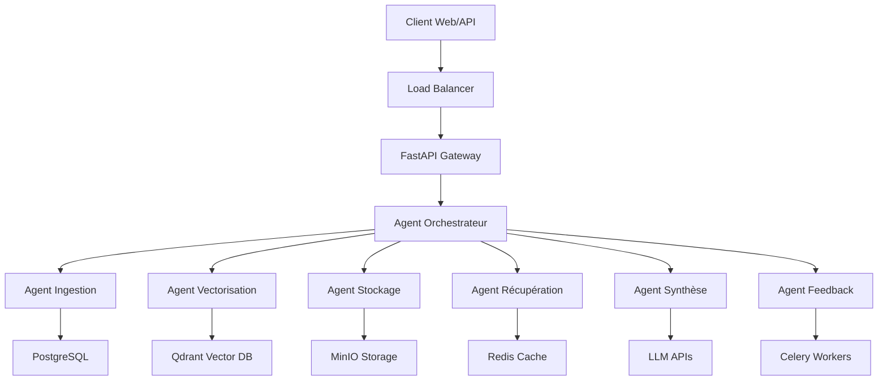

# 🚀 Système RAG Enterprise Multi-Agents

<div align="center">


**Solution RAG (Retrieval-Augmented Generation) enterprise avec architecture multi-agents**

*Intelligence artificielle conversationnelle pour la gestion documentaire d'entreprise*

</div>

---

## 📋 Vue d'ensemble

Le **Système RAG Enterprise** est une plateforme complète de gestion documentaire intelligente qui utilise l'IA pour permettre aux entreprises d'interroger leurs données de manière conversationnelle. Notre architecture multi-agents assure un traitement spécialisé, une scalabilité enterprise et une sécurité renforcée.

### 🎯 Fonctionnalités clés

- 🤖 **7 Agents spécialisés** - Orchestration, ingestion, vectorisation, stockage, récupération, synthèse, feedback
- 📚 **Traitement multi-format** - PDF, DOCX, TXT, images (OCR), audio (transcription)
- 🔍 **Recherche hybride** - Vectorielle + mots-clés pour une précision optimale
- 🛡️ **Sécurité enterprise** - RBAC, chiffrement, audit complet
- 📊 **Monitoring complet** - Prometheus, Grafana, ELK Stack
- ⚡ **Performance optimisée** - Cache Redis, file d'attente Celery
- 🌐 **API REST complète** - Documentation OpenAPI intégrée

### 🏗️ Architecture



---

## 🚀 Démarrage rapide

### Prérequis

- **Python 3.11+**
- **Docker & Docker Compose**
- **Kubernetes 1.25+** (pour production)
- **Helm 3.8+**

### Installation locale (Développement)

1. **Cloner le repository**
   ```bash
   git clone <repository-url>
   cd MAR
   ```

2. **Configuration environnement**
   ```bash
   cp .env.example .env.development
   # Éditer .env.development avec vos clés API
   ```

3. **Lancer avec Docker Compose**
   ```bash
   docker-compose -f docker-compose.yml -f docker-compose.dev.yml up -d
   ```

4. **Vérifier l'installation**
   ```bash
   curl http://localhost:8000/health
   # Accéder à l'interface: http://localhost:8000/docs
   ```

### Déploiement production

Voir le [Guide de déploiement](docs/deployment-guide.md) pour les instructions complètes.

---

## 📖 Documentation

### 📚 Guides utilisateur
- [**Guide utilisateur**](docs/user-guide.md) - Interface et fonctionnalités
- [**Documentation API**](docs/api.md) - Référence des endpoints

### 🔧 Documentation technique
- [**Guide de déploiement**](docs/deployment-guide.md) - Installation et configuration
- [**Guide de production**](docs/production-deployment-guide.md) - Mise en production
- [**Maintenance opérationnelle**](docs/operational-maintenance-guide.md) - Opérations quotidiennes
- [**Plan de reprise d'activité**](docs/disaster-recovery-plan.md) - Procédures de récupération

---

## 🏗️ Architecture technique

### Composants principaux

| Composant | Description | Technologies |
|-----------|-------------|--------------|
| **API Gateway** | Interface REST FastAPI | FastAPI, Uvicorn |
| **Agents Multi-tâches** | Traitement spécialisé | CrewAI, LangChain |
| **Base vectorielle** | Stockage embeddings | Qdrant, Weaviate |
| **Base de données** | Métadonnées | PostgreSQL |
| **Cache & Queues** | Performance | Redis, Celery |
| **Stockage objet** | Documents | MinIO, S3 |
| **Monitoring** | Observabilité | Prometheus, Grafana, ELK |

### Agents spécialisés

1. **🎭 Agent Orchestrateur** - Coordination des workflows
2. **📥 Agent Ingestion** - Traitement des documents
3. **🧮 Agent Vectorisation** - Génération d'embeddings
4. **💾 Agent Stockage** - Persistance des données
5. **🔍 Agent Récupération** - Recherche contextuelle
6. **✍️ Agent Synthèse** - Génération de réponses
7. **🧠 Agent Feedback** - Apprentissage continu

---

## ⚙️ Configuration

### Variables d'environnement

Copiez `.env.example` vers `.env` et configurez :

```bash
# Application
APP_NAME=Enterprise RAG System
ENVIRONMENT=development
DEBUG=true

# APIs LLM
OPENAI_API_KEY=sk-your-openai-key
COHERE_API_KEY=your-cohere-key
ANTHROPIC_API_KEY=your-anthropic-key

# Bases de données
POSTGRES_HOST=localhost
POSTGRES_PASSWORD=your-password
QDRANT_HOST=localhost
REDIS_URL=redis://localhost:6379
```

Voir [`.env.example`](.env.example) pour la configuration complète.

---

## 🧪 Tests

### Tests unitaires
```bash
python -m pytest tests/unit/ -v
```

### Tests d'intégration
```bash
python -m pytest tests/integration/ -v
```

### Tests de charge
```bash
cd tests/load
python -m locust -f locustfile.py --host=http://localhost:8000
```

---

## 📊 Monitoring

### Métriques disponibles

- **API** : Temps de réponse, taux d'erreur, throughput
- **Agents** : Performance individuelle, files d'attente
- **Infrastructure** : CPU, mémoire, stockage
- **Business** : Utilisation, satisfaction utilisateur

### Dashboards Grafana

- Dashboard système global
- Métriques par agent
- Performance API
- Alertes opérationnelles

---

## 🛡️ Sécurité

### Fonctionnalités de sécurité

- ✅ **Authentification SSO** - Keycloak, SAML, OIDC
- ✅ **Autorisation RBAC** - Permissions granulaires
- ✅ **Chiffrement** - TLS, données au repos
- ✅ **Audit complet** - Logs sécurisés
- ✅ **Network Policies** - Isolation réseau
- ✅ **Secrets Management** - Vault, K8s secrets

### Conformité

- **RGPD** - Protection des données personnelles
- **SOC 2** - Contrôles de sécurité
- **ISO 27001** - Gestion de la sécurité

---

## 🚀 Déploiement

### Environnements supportés

| Environnement | Description | Configuration |
|---------------|-------------|---------------|
| **Development** | Local avec Docker Compose | `docker-compose.dev.yml` |
| **Staging** | Pré-production Kubernetes | `values-staging.yaml` |
| **Production** | Production enterprise | `values-production.yaml` |

### Scripts de déploiement

```bash
# Déploiement staging
./scripts/deployment/deploy.sh staging v1.0.0

# Déploiement production
./scripts/deployment/deploy.sh production v1.0.0
```

---

## 📈 Performance

### Métriques de référence

- **Temps de réponse API** : < 200ms (P95)
- **Indexation document** : 10-50 documents/minute
- **Recherche vectorielle** : < 100ms (P95)
- **Throughput** : 1000+ requêtes/seconde
- **Disponibilité** : 99.9% SLA

### Optimisations

- Cache Redis multi-niveaux
- Index vectoriels optimisés
- Pool de connexions
- Auto-scaling Kubernetes

---

## 🛠️ Développement

### Structure du projet

```
MAR/
├── api/                 # API FastAPI
├── agents/             # Agents spécialisés
├── core/               # Configuration et utilitaires
├── database/           # Modèles et migrations
├── docs/               # Documentation
├── infrastructure/     # Kubernetes, Helm, monitoring
├── scripts/            # Scripts de déploiement
├── security/           # Authentification et autorisation
├── tasks/              # Tâches Celery
└── tests/              # Tests unitaires et intégration
```

### Contributing

1. Fork le repository
2. Créer une branche feature
3. Committer les changements
4. Pousser vers la branche
5. Créer une Pull Request

---

---

### Ressources

- [**Documentation technique**](docs/) - Guides complets
- [**API Reference**](docs/api.md) - Référence des endpoints
- [**FAQ**](docs/user-guide.md#faq) - Questions fréquentes
- [**Runbooks**](docs/runbooks/) - Procédures d'incident

---

## 🔄 Roadmap

### Version 1.1 (Q1 2025)
- [ ] Support multimodal (images, graphiques)
- [ ] Agents conversationnels avancés
- [ ] Intégrations CRM/ERP
- [ ] Mobile app

### Version 1.2 (Q2 2025)
- [ ] Fine-tuning de modèles personnalisés
- [ ] Analyse de sentiment
- [ ] Workflow automation
- [ ] Multi-tenancy avancée

---

<div align="center">

**⭐ Si ce projet vous plaît, donnez-lui une étoile !**

[Documentation](docs/) • [API](docs/api.md) • [Déploiement](docs/deployment-guide.md) • [Support](docs/user-guide.md#contact-et-support)

---

*Développé avec ❤️ 

</div>
