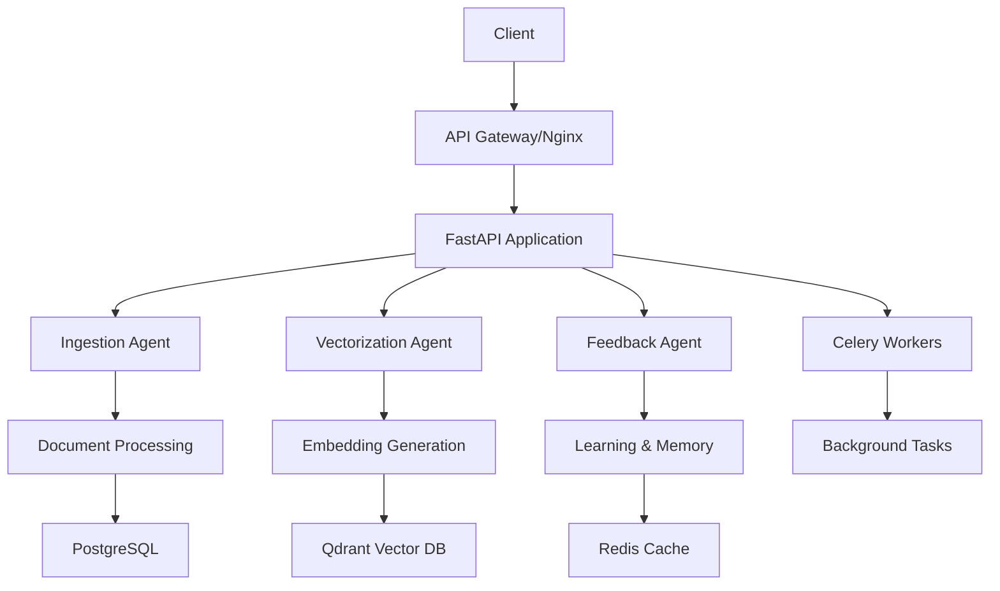

# Documentation API - Système RAG Enterprise

## Vue d'ensemble

Le système RAG (Retrieval-Augmented Generation) Enterprise est une solution complète de gestion documentaire intelligente utilisant l'intelligence artificielle pour fournir des réponses contextuelles basées sur une base de connaissances organisationnelle.

## Architecture

### Composants principaux

- **API FastAPI** : Interface REST principal
- **Agents multi-tâches** : Traitement spécialisé (ingestion, vectorisation, feedback)
- **Base vectorielle** : Stockage et recherche sémantique (Qdrant)
- **Base de données** : Métadonnées et gestion (PostgreSQL)
- **Cache Redis** : Performance et sessions
- **File d'attente Celery** : Traitement asynchrone
- **Stockage objet** : Documents et fichiers (MinIO/S3)

### Architecture multi-agent



## Authentification

Tous les endpoints nécessitent une authentification Bearer Token JWT.

### Obtenir un token

```http
POST /api/v1/auth/login
Content-Type: application/json

{
  "username": "user@example.com",
  "password": "password",
  "organization_id": "org-123"
}
```

**Réponse :**
```json
{
  "access_token": "eyJ0eXAiOiJKV1QiLCJhbGciOiJIUzI1NiJ9...",
  "token_type": "bearer",
  "expires_in": 3600,
  "user_info": {
    "user_id": "user-123",
    "username": "user@example.com",
    "roles": ["user"],
    "organization_id": "org-123"
  }
}
```

## Endpoints API

### Santé du système

#### GET /health

Vérifie l'état de santé du système.

**Réponse :**
```json
{
  "status": "healthy",
  "timestamp": "2024-01-15T10:30:00Z",
  "version": "1.0.0",
  "components": {
    "database": "healthy",
    "vector_db": "healthy",
    "redis": "healthy",
    "storage": "healthy"
  },
  "metrics": {
    "response_time": "12ms",
    "active_connections": 15,
    "memory_usage": "45%",
    "cpu_usage": "23%"
  }
}
```

### Gestion des documents

#### POST /api/v1/documents/upload

Upload et traitement d'un document.

**Headers requis :**
- `Authorization: Bearer <token>`
- `Content-Type: multipart/form-data`

**Paramètres :**
- `file` : Fichier à uploader (PDF, DOCX, TXT, etc.)
- `metadata` : Métadonnées JSON du document

**Exemple :**
```bash
curl -X POST "https://api.enterprise-rag.com/api/v1/documents/upload" \
  -H "Authorization: Bearer <token>" \
  -F "file=@document.pdf" \
  -F "metadata={\"title\":\"Manuel utilisateur\",\"category\":\"documentation\"}"
```

**Réponse :**
```json
{
  "success": true,
  "document_id": "doc-abc123",
  "filename": "document.pdf",
  "size": 1048576,
  "status": "processing",
  "estimated_processing_time": "30s",
  "processing_id": "task-xyz789"
}
```

#### GET /api/v1/documents/{document_id}

Récupère les informations d'un document.

**Réponse :**
```json
{
  "success": true,
  "document": {
    "document_id": "doc-abc123",
    "filename": "document.pdf",
    "title": "Manuel utilisateur",
    "category": "documentation",
    "status": "processed",
    "created_at": "2024-01-15T10:00:00Z",
    "updated_at": "2024-01-15T10:05:00Z",
    "size": 1048576,
    "page_count": 25,
    "language": "fr",
    "metadata": {
      "author": "Enterprise Team",
      "version": "2.1",
      "keywords": ["manuel", "documentation", "guide"]
    },
    "processing_info": {
      "chunks_count": 48,
      "processing_duration": "27s",
      "text_extraction_method": "pypdf"
    }
  }
}
```

#### GET /api/v1/documents

Liste les documents avec pagination et filtres.

**Paramètres de requête :**
- `page` : Numéro de page (défaut: 1)
- `size` : Taille de page (défaut: 20, max: 100)
- `category` : Filtrer par catégorie
- `status` : Filtrer par statut (processing, processed, error)
- `search` : Recherche textuelle
- `date_from` : Date de début (ISO 8601)
- `date_to` : Date de fin (ISO 8601)

**Exemple :**
```http
GET /api/v1/documents?page=1&size=10&category=documentation&status=processed
```

**Réponse :**
```json
{
  "success": true,
  "documents": [
    {
      "document_id": "doc-abc123",
      "filename": "document.pdf",
      "title": "Manuel utilisateur",
      "category": "documentation",
      "status": "processed",
      "created_at": "2024-01-15T10:00:00Z",
      "size": 1048576
    }
  ],
  "pagination": {
    "page": 1,
    "size": 10,
    "total": 156,
    "pages": 16,
    "has_next": true,
    "has_previous": false
  }
}
```

#### DELETE /api/v1/documents/{document_id}

Supprime un document et ses données associées.

**Réponse :**
```json
{
  "success": true,
  "message": "Document supprimé avec succès",
  "document_id": "doc-abc123"
}
```

### Chat et Requêtes

#### POST /api/v1/chat/query

Pose une question au système RAG.

**Corps de la requête :**
```json
{
  "query": "Quelle est la procédure pour les congés payés?",
  "context": {
    "session_id": "session-123",
    "conversation_id": "conv-456",
    "user_context": "Employé RH"
  },
  "preferences": {
    "response_length": "detailed",
    "language": "fr",
    "include_sources": true,
    "max_sources": 5
  },
  "filters": {
    "categories": ["policy", "hr"],
    "date_range": {
      "start": "2024-01-01",
      "end": "2024-12-31"
    }
  }
}
```

**Réponse :**
```json
{
  "success": true,
  "response": {
    "answer": "Pour les congés payés, voici la procédure à suivre...",
    "confidence": 0.92,
    "response_id": "resp-xyz789",
    "processing_time": "1.2s",
    "tokens_used": {
      "prompt": 450,
      "completion": 280,
      "total": 730
    }
  },
  "sources": [
    {
      "document_id": "doc-policy-001",
      "title": "Politique RH - Congés",
      "relevance_score": 0.95,
      "excerpt": "Les demandes de congés payés doivent être...",
      "page": 12,
      "chunk_id": "chunk-445"
    }
  ],
  "context": {
    "session_id": "session-123",
    "conversation_id": "conv-456",
    "query_embedding_time": "0.3s",
    "retrieval_time": "0.5s",
    "generation_time": "0.4s"
  }
}
```

#### POST /api/v1/chat/stream

Chat en streaming pour des réponses en temps réel.

**Corps de la requête :**
```json
{
  "query": "Expliquez la politique de télétravail",
  "stream": true,
  "context": {
    "session_id": "session-123"
  }
}
```

**Réponse (Server-Sent Events) :**
```
data: {"type": "start", "session_id": "session-123", "response_id": "resp-streaming-123"}

data: {"type": "sources", "sources": [{"document_id": "doc-policy-002", "title": "Politique télétravail"}]}

data: {"type": "content", "content": "La politique de télétravail de l'entreprise"}

data: {"type": "content", "content": " permet aux employés de travailler"}

data: {"type": "content", "content": " à distance jusqu'à 3 jours par semaine..."}

data: {"type": "end", "response_id": "resp-streaming-123", "total_tokens": 445}
```

### Recherche

#### POST /api/v1/search

Recherche sémantique dans les documents.

**Corps de la requête :**
```json
{
  "query": "formation sécurité informatique",
  "search_type": "hybrid",
  "filters": {
    "categories": ["training", "security"],
    "languages": ["fr"],
    "document_types": ["pdf", "docx"]
  },
  "options": {
    "limit": 20,
    "include_snippets": true,
    "snippet_length": 200,
    "highlight_terms": true
  }
}
```

**Réponse :**
```json
{
  "success": true,
  "results": [
    {
      "document_id": "doc-security-101",
      "title": "Formation cybersécurité obligatoire",
      "relevance_score": 0.94,
      "category": "training",
      "snippet": "La <mark>formation</mark> en <mark>sécurité informatique</mark> est obligatoire...",
      "metadata": {
        "author": "RSSI",
        "last_updated": "2024-01-10",
        "page_count": 15
      }
    }
  ],
  "search_info": {
    "total_results": 45,
    "search_time": "0.8s",
    "query_expanded": true,
    "search_strategy": "hybrid_semantic_keyword"
  },
  "suggestions": [
    "cybersécurité",
    "phishing",
    "mots de passe"
  ]
}
```

### Feedback

#### POST /api/v1/feedback

Soumet un feedback sur une réponse.

**Corps de la requête :**
```json
{
  "feedback_type": "quality",
  "rating": 4,
  "content": "Réponse très utile et complète",
  "context": {
    "response_id": "resp-xyz789",
    "query": "Quelle est la procédure pour les congés payés?",
    "session_id": "session-123"
  },
  "suggestions": [
    "Ajouter des exemples concrets",
    "Mentionner les exceptions"
  ]
}
```

**Réponse :**
```json
{
  "success": true,
  "feedback_id": "feedback-456",
  "message": "Feedback enregistré avec succès",
  "learning_applied": true,
  "improvements_suggested": 2
}
```

### Analytics

#### GET /api/v1/analytics/summary

Récupère un résumé des analytics.

**Paramètres de requête :**
- `period` : Période d'analyse (1d, 7d, 30d, 90d)
- `granularity` : Granularité (hour, day, week)

**Réponse :**
```json
{
  "success": true,
  "analytics": {
    "period": "7d",
    "summary": {
      "total_queries": 1247,
      "unique_users": 89,
      "documents_processed": 156,
      "average_response_time": "1.4s",
      "satisfaction_rate": 0.87
    },
    "trends": {
      "queries_trend": "+12%",
      "users_trend": "+5%",
      "satisfaction_trend": "+3%"
    },
    "top_categories": [
      {"category": "hr", "queries": 445, "percentage": 35.7},
      {"category": "it", "queries": 298, "percentage": 23.9},
      {"category": "policy", "queries": 267, "percentage": 21.4}
    ],
    "performance_metrics": {
      "p50_response_time": "0.9s",
      "p95_response_time": "2.1s",
      "p99_response_time": "3.8s",
      "error_rate": 0.012
    }
  }
}
```

## Codes d'erreur

### Codes de statut HTTP

- `200` : Succès
- `201` : Créé avec succès
- `400` : Requête invalide
- `401` : Non authentifié
- `403` : Non autorisé
- `404` : Resource non trouvée
- `422` : Erreur de validation
- `429` : Trop de requêtes
- `500` : Erreur serveur interne
- `503` : Service indisponible

### Format des erreurs

```json
{
  "success": false,
  "error": {
    "code": "VALIDATION_ERROR",
    "message": "Le fichier dépasse la taille maximale autorisée",
    "details": {
      "field": "file",
      "max_size": "50MB",
      "received_size": "75MB"
    },
    "request_id": "req-abc123",
    "timestamp": "2024-01-15T10:30:00Z"
  }
}
```

### Codes d'erreur spécifiques

| Code | Description | Solution |
|------|-------------|----------|
| `AUTH_TOKEN_EXPIRED` | Token JWT expiré | Renouveler le token |
| `INVALID_FILE_FORMAT` | Format de fichier non supporté | Utiliser PDF, DOCX, TXT ou HTML |
| `FILE_TOO_LARGE` | Fichier trop volumineux | Réduire la taille (max 50MB) |
| `QUOTA_EXCEEDED` | Quota d'organisation dépassé | Contacter l'administrateur |
| `PROCESSING_FAILED` | Échec du traitement | Réessayer ou contacter le support |
| `RATE_LIMIT_EXCEEDED` | Limite de taux dépassée | Attendre avant de réessayer |

## Rate Limiting

Le système applique des limites de taux pour assurer la stabilité :

- **API générale** : 100 requêtes/minute par utilisateur
- **Upload de documents** : 10 uploads/minute par utilisateur
- **Requêtes chat** : 50 requêtes/minute par utilisateur
- **Recherche** : 200 requêtes/minute par utilisateur

**Headers de réponse :**
```
X-RateLimit-Limit: 100
X-RateLimit-Remaining: 95
X-RateLimit-Reset: 1705315800
```

## Pagination

Les endpoints retournant des listes utilisent une pagination basée sur les paramètres :

- `page` : Numéro de page (1-based)
- `size` : Nombre d'éléments par page
- `sort` : Champ de tri
- `order` : Direction (asc/desc)

**Exemple :**
```http
GET /api/v1/documents?page=2&size=20&sort=created_at&order=desc
```

## Webhooks

Le système peut envoyer des notifications via webhooks pour certains événements.

### Configuration

```json
{
  "webhook_url": "https://your-app.com/webhooks/rag",
  "events": ["document.processed", "document.failed", "feedback.received"],
  "secret": "webhook-secret-key"
}
```

### Format des événements

```json
{
  "event": "document.processed",
  "timestamp": "2024-01-15T10:30:00Z",
  "data": {
    "document_id": "doc-abc123",
    "filename": "document.pdf",
    "status": "processed",
    "processing_time": "27s"
  },
  "organization_id": "org-123",
  "signature": "sha256=..."
}
```

## SDKs et intégrations

### SDK Python

```python
from enterprise_rag import RAGClient

# Initialisation
client = RAGClient(
    api_url="https://api.enterprise-rag.com",
    token="your-jwt-token"
)

# Upload d'un document
with open("document.pdf", "rb") as f:
    result = client.upload_document(
        file=f,
        metadata={"title": "Document important", "category": "policy"}
    )

# Requête chat
response = client.query(
    "Quelle est la politique de congés?",
    include_sources=True
)

print(response.answer)
for source in response.sources:
    print(f"Source: {source.title} (score: {source.relevance_score})")
```

### SDK JavaScript

```javascript
import { RAGClient } from '@enterprise-rag/sdk';

// Initialisation
const client = new RAGClient({
  apiUrl: 'https://api.enterprise-rag.com',
  token: 'your-jwt-token'
});

// Upload d'un document
const formData = new FormData();
formData.append('file', fileInput.files[0]);
formData.append('metadata', JSON.stringify({
  title: 'Document important',
  category: 'policy'
}));

const uploadResult = await client.uploadDocument(formData);

// Requête chat
const response = await client.query({
  query: 'Quelle est la politique de congés?',
  includeSources: true
});

console.log(response.answer);
```

## Exemples d'utilisation

### Cas d'usage : Support client automatisé

```python
# Configuration du bot de support
support_bot = RAGClient(token="support-bot-token")

def handle_customer_query(query, customer_context):
    response = support_bot.query(
        query=query,
        context={
            "customer_id": customer_context["id"],
            "session_id": customer_context["session"],
            "user_context": "Support client"
        },
        filters={
            "categories": ["faq", "support", "procedures"]
        },
        preferences={
            "response_length": "concise",
            "include_sources": True
        }
    )
    
    return {
        "answer": response.answer,
        "confidence": response.confidence,
        "sources": [s.title for s in response.sources]
    }
```

### Cas d'usage : Recherche documentaire avancée

```python
# Recherche multi-critères
def advanced_document_search(user_query, filters=None):
    return client.search(
        query=user_query,
        search_type="hybrid",
        filters={
            "categories": filters.get("categories", []),
            "date_range": {
                "start": filters.get("date_from"),
                "end": filters.get("date_to")
            },
            "languages": ["fr", "en"]
        },
        options={
            "limit": 50,
            "include_snippets": True,
            "highlight_terms": True
        }
    )
```

## Monitoring et observabilité

### Métriques disponibles

Le système expose des métriques Prometheus sur `/metrics` :

- `rag_requests_total` : Nombre total de requêtes
- `rag_request_duration_seconds` : Temps de réponse
- `rag_documents_processed_total` : Documents traités
- `rag_embeddings_generated_total` : Embeddings générés
- `rag_feedback_received_total` : Feedbacks reçus
- `rag_active_sessions` : Sessions actives

### Logs structurés

```json
{
  "timestamp": "2024-01-15T10:30:00Z",
  "level": "INFO",
  "logger": "rag.api.chat",
  "message": "Query processed successfully",
  "data": {
    "user_id": "user-123",
    "query_id": "query-456",
    "response_time": 1.2,
    "sources_found": 5,
    "confidence": 0.92
  },
  "trace_id": "trace-abc123"
}
```

## Support et contact

- **Documentation** : https://docs.enterprise-rag.com
- **Support technique** : support@enterprise-rag.com
- **Statut des services** : https://status.enterprise-rag.com
- **GitHub** : https://github.com/enterprise/rag-system
